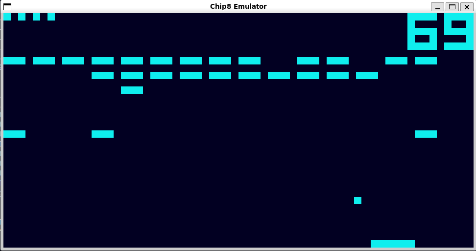
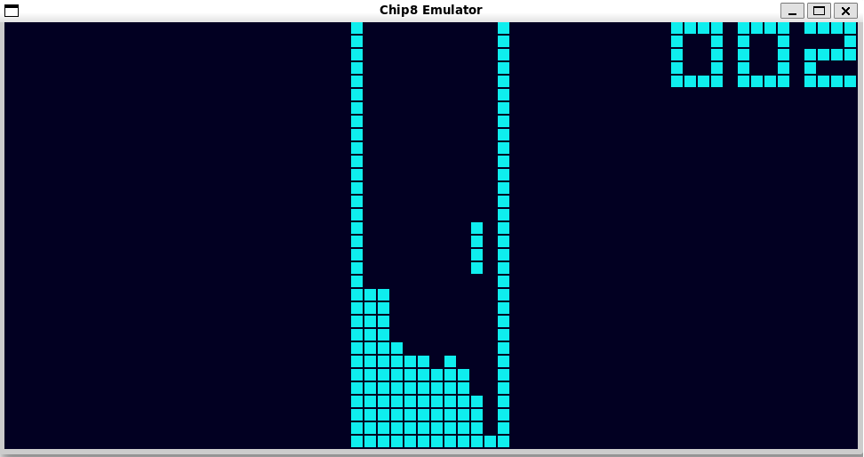
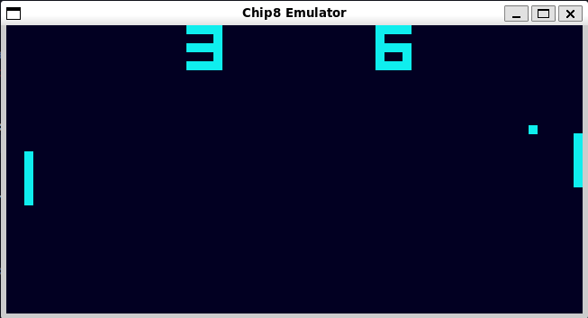

# Run-Of-The-Mill Chip8 Emulator in C

Are you tired of playing modern games with high-end graphics and complex gameplay? Do you yearn for the simpler times of the 1970s and 80s when games were blocky, pixelated, and ran on machines with less processing power than your microwave? Well then, you've come to the right place! Welcome to the Super Run-Of-The-Mill Chip8 Emulator - the perfect tool for all your retro gaming needs!


## Screenshots

As you can see, the graphics are blocky and pixelated - just like they were back in the 70s. But don't let that fool you - these games can be just as addictive as any modern title.

Brix carnage:



Tetris havoc (with `--border` option on, to draw pixel outlines):


 
Pong mayhem (with `--scale-factor` set to 10, making pixels less thicc)




## How to Use

First things first, you'll need to get your hands on some Chip8 ROMs. Can't help you with that - but let's be honest, you're probably already a pro at downloading shady files from the internet. Once you have your ROMs, simply fire up the emulator and load in the ROM of your choice.

Emulator ships with some default keybindings. If you don't like the defaults, tough luck - this is a run-of-the-mill emulator, not a customizable gaming experience. It's not like you had a ton of options back in the 80s either.

If you want to build it yourself, you'll need [SDL2](https://github.com/libsdl-org/SDL) installed on your machine.

Build with: 

```
$ make
```

and then run with:

```
$ ./chip8 <path-to-rom> [--scale-factor n] [--border]
```

Settings flags are optional:
- `--scale-factor` to set the size of the pixels
- `--border` to draw pixel borders 


## Technical Details

The emulator is written in C - the language of choice for all serious developers who don't want to waste their time with fancy abstractions or high-level concepts like "garbage collection" or "hierarchical inheritance". Things are kept simple and straightforward, just like the good old days.

The emulator is levaraging the power of SDL2 library as it provides us with a consistent interface for handling graphics, sound, and input - so we can focus on what really matters: emulating those sweet, sweet retro games.


## Known Issues

Of course, no emulator is perfect - especially one as run-of-the-mill as this. Here are some of the issues you might encounter:

- Some games might not run properly. Don't worry, it's not like there are a ton of Chip8 games out there anyway.
- The sound emulation is... let's just say "minimalistic". It beeps and boops.
- I haven't tested this on every possible hardware configuration out there. If you encounter issues, just assume that it's your fault and move on.


## Conclusion

In conclusion, if you're looking for a Chip8 emulator that's as basic and unremarkable as they come, then you've hit the jackpot. This emulator is so run-of-the-mill, it's practically beige. So why wait? Fire it up, load up some retro games, and bask in the glory of a bygone era. Happy gaming!


## Resources

- [Queso Fuego's Chip8 emulator series](https://www.youtube.com/@QuesoFuego)
- [Guide to making a CHIP-8 emulator](https://tobiasvl.github.io/blog/write-a-chip-8-emulator)
- [Wikipedia](https://en.wikipedia.org/wiki/CHIP-8)
- [Chip-8 Design Specification](https://www.cs.columbia.edu/~sedwards/classes/2016/4840-spring/designs/Chip8.pdf)
